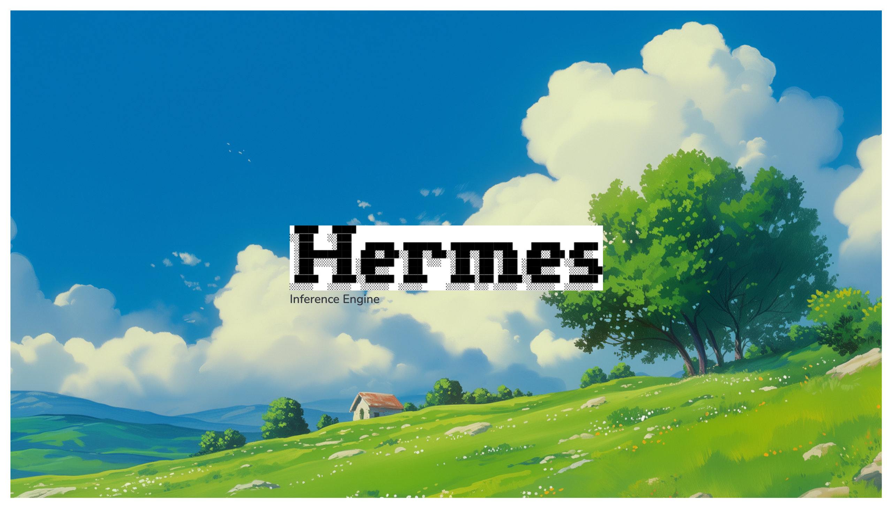

# Hermes

> [!IMPORTANT]
> 
> I am building this project to learn about the internals of llm inference
>
> This is a work in progress.

I will be starting with simple llm forward pass with kv cache.

## Stuff to add 

- [ ] Handle the kv cache memory uses
- [ ] Specualative decoding
....
